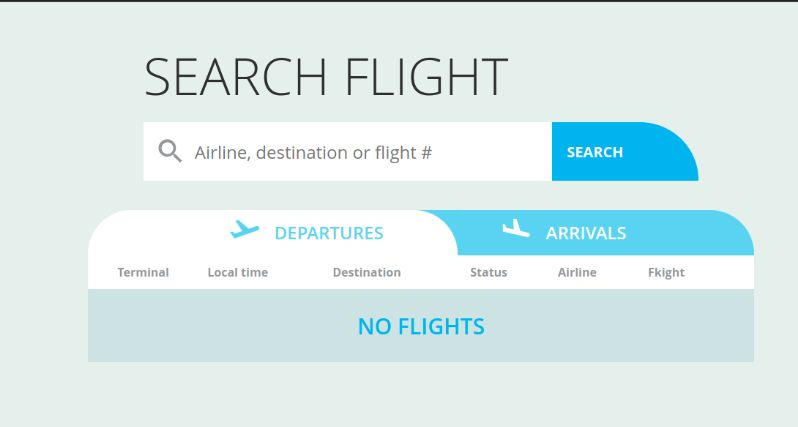

# react-airport

### [Site link](https://62a72d3e892e41000875fc29--magical-dasik-1252a2.netlify.app/)

<kbd>
  
</kbd>

 ### 🛠 The tech stack is:

- [React](https://reactjs.org/)
- [React-router-dom](https://reactrouter.com/docs/en/v6/getting-started/overview)
- [Redux](https://redux.js.org/)
- [Redux-thunk](https://redux.js.org/usage/writing-logic-thunks)
- [HTML5](https://en.wikipedia.org/wiki/HTML5)
- [CSS3](https://en.wikipedia.org/wiki/Cascading_Style_Sheets)
- [Flexbox](https://en.wikipedia.org/wiki/CSS_Flexible_Box_Layout)
- [Sass (Scss)](https://sass-lang.com/)
- [BEM methodology](https://en.bem.info/methodology/)
- [Webpack](https://webpack.js.org/)
- [PropTypes](https://ru.reactjs.org/docs/typechecking-with-proptypes.html)
- [axios](https://github.com/axios/axios)

